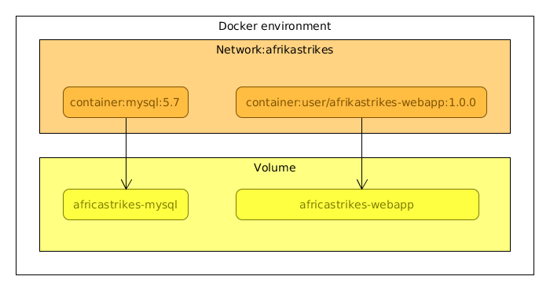

# A local docker deployment

We are going to setup a stack of two services in an isolated network for a simple solution.
Both services need persistent storage:

1. Install the docker engine
2. A network
3. A volume for persistent storage
4. A mysql database
5. A web application that depends on this database
6. Run docker-compose to create the stack

Commands below you are in the _docker_ folder of this project.



### 1. Install docker and docker-compose

For this simple setup use the [Docker CE](https://docs.docker.com/engine/installation/)
and [Docker compose](https://docs.docker.com/compose/install/)

### 2. Declare the network
The network will isolate the applications from others stacks that live in their networks.
 
In the compose file add a _africastrikes_ network:

```yaml
networks:
  africastrikes:
```
### 3. Declare the storage
The database and webapp both need to persist state.
 
In the [docker-compose.yaml](docker-compose.yaml) file declare the _volumes_ for the 'mysql' and 'webapp' database:

```yaml
volumes:
  africastrikes-mysql:
  africastrikes-webapp:
```
### 4. MySql database
No need to build an image. A mysql:5.7 image comes from the docker registry:

https://hub.docker.com/r/mysql/mysql-server/

In the [docker-compose.yaml](docker-compose.yaml) file declare the _mysql:5.7_ image and link it to the volume and network:

```yaml
mysql:
  deploy:
    mode: replicated
    replicas: 1
    restart_policy:
      condition: on-failu  re
  environment:
    MYSQL_DATABASE: africastrikes
    MYSQL_ONETIME_PASSWORD: "yes"
    MYSQL_PASSWORD: africastrikes
    MYSQL_RANDOM_ROOT_PASSWORD: "yes"
    MYSQL_USER: africastrikes
  image: mysql:5.7
  networks:
    - africastrikes
  volumes:
    - africastrikes-mysql:/var/lib/mysql
```

### 5. Build the web application
Note that this file pulls a pre-compiled version of the web application.
So if you want to build the images with your own jar, replace this line to ADD or COPY in your jar.
  
Build the image with a version point 1.0.0:

    $ cd docker/webapp
    $ docker build -t user/africastrikes-webapp:1.0.0 .
    
Alternatively you can also build the image with docker-compose:

    $ docker-compose build

Again in the [docker-compose.yaml](docker-compose.yaml) file declare the _user/africastrikes-webapp:1.0.0_ and link it to the volume and network.
Also open up port 8000 for upd\tcp traffic forwarding into the docker environment:
```yaml
webapp:
  depends_on:
   - mysql
  deploy:
    mode: replicated
    replicas: 1
    restart_policy:
      condition: on-failure
      delay: 10s
  environment:
    ARTICLE_FILE_PATH: /data
    APPLY_EVOLUTIONS_DEFAULT: "true"
    DB_DEFAULT_URL: jdbc:mysql://mysql/africastrikes
  image: user/africastrikes-webapp:1.0.0
  networks:
    - africastrikes
  ports:
    - 8000:8000
  volumes:
    - africastrikes-webapp:/data
```    

### 6. Run the stack

To run the services:

    $ docker-compose up
    
And start the web application:
    
    $ http://localhost:8000
 
 To enter a shell into the container, select the container ID:
 
     $ docker ps
     
 and exec a command, like:
 
     $ docker exec -it [ID of the container] bash